# 🏗️ Modelo C4 - Arquitectura de PetCare Solution

Este documento describe la arquitectura de **PetCare Solution** utilizando el modelo C4 (Contexto, Contenedores, Componentes y Código).

---

## 1. Nivel 1: Diagrama de Contexto del Sistema
Muestra el sistema en el contexto de su entorno y los usuarios que interactúan con él.

```mermaid
C4Context
    title Diagrama de Contexto - PetCare Solution

    Person(cliente, "Cliente", "Dueño de mascota que busca servicios de cuidado.")
    Person(cuidador, "Cuidador", "Profesional que ofrece servicios de cuidado de mascotas.")
    Person(admin, "Administrador", "Gestiona usuarios y valida documentos.")

    System(petcare, "PetCare Solution", "Plataforma de microservicios para conectar clientes y cuidadores.")

    System_Ext(payment_gateway, "Pasarela de Pagos", "Procesa los pagos (Stripe/PayPal).")
    System_Ext(email_system, "Sistema de Email", "Envía notificaciones y recuperaciones de contraseña.")

    Rel(cliente, petcare, "Busca cuidadores, crea solicitudes, califica.")
    Rel(cuidador, petcare, "Gestiona perfil, acepta solicitudes.")
    Rel(admin, petcare, "Verifica usuarios, gestiona sistema.")

    Rel(petcare, payment_gateway, "Procesa transacciones financieras.")
    Rel(petcare, email_system, "Envía correos electrónicos.")
```



---

## 2. Nivel 2: Diagrama de Contenedores
Muestra las aplicaciones, servicios y bases de datos que componen el sistema.

```mermaid
C4Container
    title Diagrama de Contenedores - PetCare Solution

    Person(cliente, "Cliente", "Usuario final")
    Person(cuidador, "Cuidador", "Proveedor de servicio")

    Container_Boundary(api_boundary, "PetCare Microservices Ecosystem") {
        
        Container(auth_service, "Auth Service", "ASP.NET Core", "Gestiona usuarios, roles y JWT.")
        Container(client_service, "Cliente Service", "ASP.NET Core", "Gestiona perfiles de clientes.")
        Container(caretaker_service, "Cuidador Service", "ASP.NET Core", "Gestiona perfiles de cuidadores.")
        Container(request_service, "Request Service", "ASP.NET Core", "Orquesta solicitudes de servicio.")
        Container(rating_service, "Rating Service", "ASP.NET Core", "Gestiona calificaciones y reseñas.")
        Container(payment_service, "Payment Service", "ASP.NET Core", "Procesa pagos (Futuro).")

        ContainerDb(auth_db, "Auth DB", "SQL Server", "Credenciales y Roles")
        ContainerDb(client_db, "Cliente DB", "SQL Server", "Datos de Clientes")
        ContainerDb(caretaker_db, "Cuidador DB", "SQL Server", "Datos de Cuidadores")
        ContainerDb(request_db, "Request DB", "SQL Server", "Solicitudes y Estados")
        ContainerDb(rating_db, "Rating DB", "SQL Server", "Calificaciones")
    }

    Rel(cliente, auth_service, "Login/Register", "JSON/HTTPS")
    Rel(cliente, client_service, "Gestiona perfil", "JSON/HTTPS")
    Rel(cliente, request_service, "Crea solicitud", "JSON/HTTPS")
    Rel(cliente, rating_service, "Califica servicio", "JSON/HTTPS")

    Rel(cuidador, auth_service, "Login/Register", "JSON/HTTPS")
    Rel(cuidador, caretaker_service, "Gestiona perfil", "JSON/HTTPS")
    Rel(cuidador, request_service, "Acepta solicitud", "JSON/HTTPS")

    Rel(request_service, client_service, "Valida cliente", "gRPC/HTTP")
    Rel(request_service, caretaker_service, "Valida cuidador", "gRPC/HTTP")
    Rel(rating_service, request_service, "Verifica finalización", "gRPC/HTTP")

    Rel(auth_service, auth_db, "Reads/Writes", "EF Core")
    Rel(client_service, client_db, "Reads/Writes", "EF Core")
    Rel(caretaker_service, caretaker_db, "Reads/Writes", "EF Core")
    Rel(request_service, request_db, "Reads/Writes", "EF Core")
    Rel(rating_service, rating_db, "Reads/Writes", "EF Core")
```



---

## 3. Nivel 3: Diagrama de Componentes - Auth Service
Detalla la estructura interna del servicio de autenticación, responsable de la identidad y seguridad.

```mermaid
C4Component
    title Diagrama de Componentes - Auth Service

    Container(auth_service, "Auth Service", "ASP.NET Core Web API", "Gestiona identidad y tokens.")

    Component(auth_controller, "AuthController", "ASP.NET Core MVC", "Expone endpoints de Login y Registro.")
    Component(auth_domain_service, "AuthService", "C# Class", "Lógica de negocio: validación de credenciales, generación de tokens.")
    Component(user_manager, "UserManager<User>", "ASP.NET Identity", "Gestión de usuarios y passwords.")
    Component(signin_manager, "SignInManager<User>", "ASP.NET Identity", "Gestión de sesiones.")
    Component(db_context, "AuthDbContext", "EF Core", "Contexto de base de datos.")

    ContainerDb(auth_db, "Auth DB", "SQL Server", "Almacena usuarios y roles.")

    Rel(auth_controller, auth_domain_service, "Llama a")
    Rel(auth_domain_service, user_manager, "Crea/Busca usuarios")
    Rel(auth_domain_service, signin_manager, "Valida passwords")
    Rel(user_manager, db_context, "Persiste datos")
    Rel(db_context, auth_db, "Lee/Escribe")
```



---

## 4. Nivel 4: Código Principal - Auth Service
A continuación se muestra la lógica central del servicio de autenticación (`AuthService.cs`), encargada del registro y login.

```csharp
// PetCareServicios.Services.AuthService

public async Task<AuthResponse> RegisterAsync(RegisterRequest model)
{
    // 1. Validar si el usuario ya existe
    var existingUserByPhone = await _userManager.Users
        .FirstOrDefaultAsync(u => u.PhoneNumber == model.PhoneNumber);
    
    if (existingUserByPhone != null)
    {
        return new AuthResponse { Success = false, Message = "El número de teléfono ya está registrado." };
    }

    // 2. Crear entidad de usuario
    var user = new User
    {
        UserName = model.Email,
        Email = model.Email,
        Name = model.Name,
        PhoneNumber = model.PhoneNumber
    };

    // 3. Persistir usuario con password hasheado
    var result = await _userManager.CreateAsync(user, model.Password);

    if (!result.Succeeded)
    {
        return new AuthResponse { Success = false, Message = string.Join(", ", result.Errors.Select(e => e.Description)) };
    }

    // 4. Asignar rol
    await _userManager.AddToRoleAsync(user, model.Role);

    // 5. Generar Token y retornar éxito
    return new AuthResponse
    {
        Success = true,
        Token = await GenerateJwtToken(user),
        Message = $"Registro exitoso como {model.Role}"
    };
}

public async Task<AuthResponse> LoginAsync(LoginRequest model)
{
    // 1. Validar credenciales
    var result = await _signInManager.PasswordSignInAsync(model.Email, model.Password, false, false);

    if (!result.Succeeded)
    {
        return new AuthResponse { Success = false, Message = "Credenciales inválidas" };
    }

    // 2. Obtener usuario y roles
    var user = await _userManager.FindByEmailAsync(model.Email);
    var roles = await _userManager.GetRolesAsync(user);

    // 3. Generar Token JWT
    return new AuthResponse
    {
        Success = true,
        Token = await GenerateJwtToken(user),
        User = new UserInfo
        {
            Id = user.Id,
            Name = user.Name,
            Email = user.Email,
            Roles = roles.ToList()
        },
        Message = "Inicio de sesión exitoso"
    };
}
```
