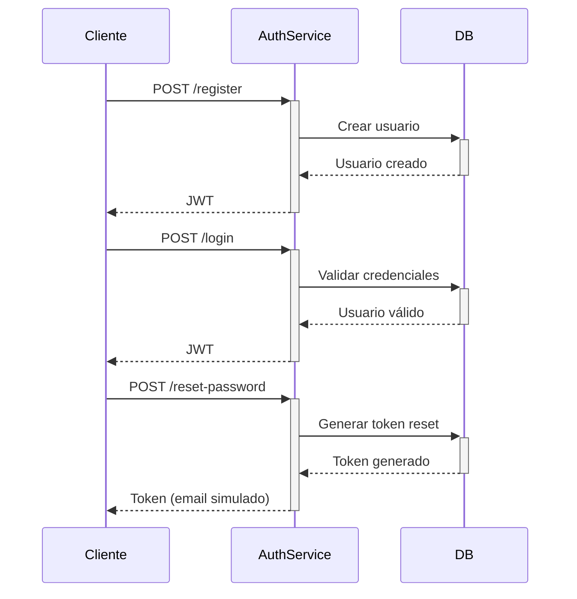

# PetCare - Auth Service 🔐

Microservicio de autenticación para PetCare con JWT e Identity

## Estructura del Proyecto 🏗️
PetCare.Auth/
├── Controllers/
│ └── AuthController.cs # Endpoints de autenticación ✅
├── Data/
│ └── AuthDbContext.cs # Contexto de BD con Identity ✅
├── Migrations/
│ ├── README.md # Documentación de migraciones ✅
│ └── *.cs # Archivos de migración ✅
├── Models/
│ ├── Auth/
│ │ ├── AuthResponse.cs # Respuesta de autenticación ✅
│ │ ├── LoginRequest.cs # DTO para login ✅
│ │ ├── RegisterRequest.cs # DTO para registro ✅
│ │ ├── PasswordReset*.cs # DTOs para reset de contraseña ✅
│ │ ├── User.cs # Entidad Usuario extendida ✅
│ │ └── UserRole.cs # Roles personalizados ✅
├── Services/
│ └── AuthService.cs # Lógica de autenticación ✅
├── Program.cs # Configuración principal ✅
├── appsettings.json # Configuración local ✅
└── appsettings.Docker.json # Configuración Docker ✅

## Endpoints principales 🌐

| Método | Endpoint           | Descripción                           | Status |
|--------|--------------------|---------------------------------------|--------|
| POST   | /api/auth/register | Registro de nuevos usuarios (Cliente/Cuidador) | ✅ |
| POST   | /api/auth/login    | Inicio de sesión (obtener JWT)        | ✅ |
| POST   | /api/auth/reset-password | Solicitar reset de contraseña    | ✅ |
| POST   | /api/auth/confirm-reset | Confirmar reset de contraseña    | ✅ |
| POST   | /api/auth/change-password | Cambio directo de contraseña     | ✅ |

## Configuración ⚙️

### Desarrollo Local (`appsettings.json`):
```json
{
  "ConnectionStrings": {
    "Default": "Server=localhost,1433;Database=PetCareAuth;User Id=sa;Password=admin1234;TrustServerCertificate=true;"
  },
  "Jwt": {
    "Key": "TuClaveSecretaDe64CaracteresParaJWTTokenSeguro2024",
    "Issuer": "PetCare.Auth",
    "Audience": "PetCare.Client",
    "ExpireDays": 7
  }
}
```

### Docker (`appsettings.Docker.json`):
```json
{
  "ConnectionStrings": {
    "Default": "Server=db;Database=PetCareAuth;User Id=sa;Password=YourStrong@Passw0rd;TrustServerCertificate=true;"
  },
  "Jwt": {
    "Key": "TuClaveSecretaDe64CaracteresParaJWTTokenSeguro2024",
    "Issuer": "PetCare.Auth",
    "Audience": "PetCare.Client",
    "ExpireDays": 7
  }
}
```

## Características Implementadas ✨

- ✅ **Autenticación JWT** con tokens seguros
- ✅ **Registro de usuarios** con validación
- ✅ **Login con credenciales** 
- ✅ **Reset de contraseña** por email (simulado)
- ✅ **Roles de usuario** (Admin, Cliente, Veterinario)
- ✅ **Validación de datos** con Data Annotations
- ✅ **Swagger/OpenAPI** para documentación
- ✅ **Base de datos automática** en desarrollo
- ✅ **Migraciones automáticas** con EF Core
- ✅ **Carpeta de migraciones** con documentación
- ✅ **Configuración simple** en appsettings.json
- ✅ **Docker ready** con appsettings.Docker.json

## Uso 🚀

### Desarrollo Local
```bash
# 1. Configurar SQL Server local
# - Instalar SQL Server en localhost:1433
# - Usuario: sa, Contraseña: admin1234

# 2. Ejecutar aplicación
cd auth-service/PetCare.Auth
dotnet run

# 3. Acceder a Swagger
# http://localhost:5001/swagger
```

### Docker
```bash
# 1. Ejecutar con Docker Compose
docker-compose up -d

# 2. Acceder a Swagger
# http://localhost:5001/swagger
```

### Migraciones
```bash
# Aplicar migraciones
dotnet ef database update

# Crear nueva migración
dotnet ef migrations add NombreMigracion
```

## Ejemplos de Uso 📝

### Registro de Cliente
```json
POST /api/auth/register
{
  "email": "cliente@ejemplo.com",
  "password": "Password123!",
  "name": "Cliente Ejemplo",
  "role": "Cliente"
}
```

### Registro de Cuidador
```json
POST /api/auth/register
{
  "email": "cuidador@ejemplo.com",
  "password": "Password123!",
  "name": "Cuidador Ejemplo",
  "role": "Cuidador"
}
```

### Login
```json
POST /api/auth/login
{
  "email": "cliente@ejemplo.com",
  "password": "Password123!"
}
```

### Reset de Contraseña
```json
POST /api/auth/reset-password
{
  "email": "usuario@ejemplo.com"
}
```

## Roles de Usuario 👥

### Roles Disponibles
- **Cliente** - Usuarios que solicitan servicios de cuidado de mascotas
- **Cuidador** - Usuarios que ofrecen servicios de cuidado de mascotas
- **Admin** - Administradores del sistema (creado automáticamente)

### Asignación de Roles
- Los roles se asignan durante el registro
- Solo se permiten roles "Cliente" o "Cuidador" en el registro
- El rol se incluye en el JWT token para autorización
- Los roles se crean automáticamente en la base de datos

## Seguridad 🔒

- Contraseñas hasheadas con Identity
- Tokens JWT con expiración configurable
- Validación de email único
- Requisitos de contraseña segura
- Tokens de reset con expiración
- Validación de roles en el registro

## Dependencias 📦

- Microsoft.AspNetCore.Authentication.JwtBearer
- Microsoft.AspNetCore.Identity.EntityFrameworkCore
- Microsoft.EntityFrameworkCore.SqlServer
- System.IdentityModel.Tokens.Jwt
- Swashbuckle.AspNetCore

## Diagrama de Flujo 🔄

