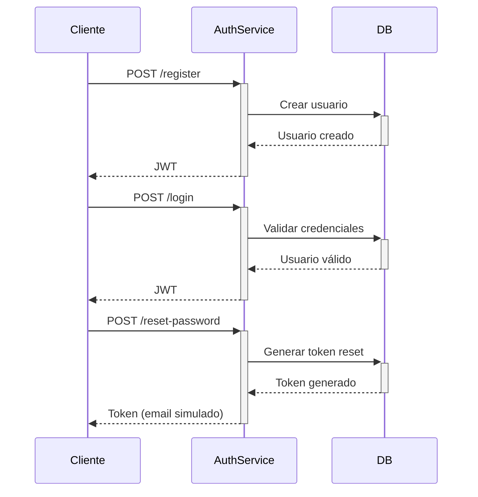

# PetCare - Auth Service 🔐

Microservicio de autenticación para PetCare con JWT e Identity

## Estructura del Proyecto 🏗️
PetCare.Auth/
├── Controllers/
│ └── AuthController.cs # Endpoints de autenticación ✅
├── Data/
│ └── AuthDbContext.cs # Contexto de BD con Identity ✅
├── Migrations/
│ ├── README.md # Documentación de migraciones ✅
│ └── *.cs # Archivos de migración ✅
├── Models/
│ ├── Auth/
│ │ ├── AuthResponse.cs # Respuesta de autenticación ✅
│ │ ├── LoginRequest.cs # DTO para login ✅
│ │ ├── RegisterRequest.cs # DTO para registro ✅
│ │ ├── PasswordReset*.cs # DTOs para reset de contraseña ✅
│ │ ├── User.cs # Entidad Usuario extendida ✅
│ │ └── UserRole.cs # Roles personalizados ✅
├── Services/
│ └── AuthService.cs # Lógica de autenticación ✅
├── Config/
│ ├── JwtConfig.cs # Configuración JWT ✅
│ └── DatabaseConfig.cs # Configuración de BD ✅
├── config/
│ ├── database.json # Configuración externa de BD ✅
│ └── database.example.json # Ejemplo de configuración ✅
├── scripts/
│ ├── init-project.ps1 # Script de inicialización ✅
│ ├── manage-migrations.ps1 # Gestor de migraciones ✅
│ └── manage-database-config.ps1 # Gestor de configuración BD ✅
├── Program.cs # Configuración principal ✅
└── appsettings.json # Configuraciones ✅

## Endpoints principales 🌐

| Método | Endpoint           | Descripción                           | Status |
|--------|--------------------|---------------------------------------|--------|
| POST   | /api/auth/register | Registro de nuevos usuarios (Cliente/Cuidador) | ✅ |
| POST   | /api/auth/login    | Inicio de sesión (obtener JWT)        | ✅ |
| POST   | /api/auth/reset-password | Solicitar reset de contraseña    | ✅ |
| POST   | /api/auth/confirm-reset | Confirmar reset de contraseña    | ✅ |
| POST   | /api/auth/change-password | Cambio directo de contraseña     | ✅ |

## Configuración ⚙️

### 1. JWT Settings (`appsettings.json`):
```json
"Jwt": {
  "Key": "TuClaveSecretaDe64CaracteresParaJWTTokenSeguro2024",
  "Issuer": "PetCare.Auth",
  "Audience": "PetCare.Client",
  "ExpireDays": 7
}
```

### 2. Configuración Externa de Base de Datos (`config/database.json`):
```json
{
  "ConnectionStrings": {
    "Default": "Server=localhost;Database=PetCareAuth;User=sa;Password=admin1234;TrustServerCertificate=true;",
    "Development": "Server=localhost;Database=PetCareAuth_Dev;User=sa;Password=admin1234;TrustServerCertificate=true;",
    "Testing": "Server=localhost;Database=PetCareAuth_Test;User=sa;Password=admin1234;TrustServerCertificate=true;",
    "Production": "Server=prod-server;Database=PetCareAuth_Prod;User=petcare_user;Password=SecurePassword123;TrustServerCertificate=true;"
  },
  "DatabaseSettings": {
    "CommandTimeout": 30,
    "EnableRetryOnFailure": true,
    "MaxRetryCount": 3,
    "RetryDelay": 5
  }
}
```

### 3. Configuración por Entorno:
- **Development**: Usa `ConnectionStrings.Development`
- **Testing**: Usa `ConnectionStrings.Testing`
- **Production**: Usa `ConnectionStrings.Production`
- **Default**: Usa `ConnectionStrings.Default` como fallback

### 4. Ventajas de la Configuración Externa:
- ✅ **Sin recompilación** al cambiar conexiones
- ✅ **Múltiples entornos** configurados
- ✅ **Retry policies** automáticas
- ✅ **Backup automático** de configuraciones
- ✅ **Validación** de connection strings

## Características Implementadas ✨

- ✅ **Autenticación JWT** con tokens seguros
- ✅ **Registro de usuarios** con validación
- ✅ **Login con credenciales** 
- ✅ **Reset de contraseña** por email (simulado)
- ✅ **Roles de usuario** (Admin, Cliente, Veterinario)
- ✅ **Validación de datos** con Data Annotations
- ✅ **Swagger/OpenAPI** para documentación
- ✅ **Base de datos automática** en desarrollo
- ✅ **Migraciones automáticas** con EF Core
- ✅ **Carpeta de migraciones** con documentación
- ✅ **Configuración externa de BD** sin recompilación
- ✅ **Múltiples entornos** (Dev, Test, Prod)
- ✅ **Retry policies** para conexiones

## Uso 🚀

### Opción 1: Inicialización Automática (Recomendada)
```bash
cd auth-service/PetCare.Auth
.\scripts\init-project.ps1
dotnet run
```

### Opción 2: Inicialización Manual
```bash
cd auth-service/PetCare.Auth
dotnet restore
dotnet build
dotnet ef database update
dotnet run
```

### 3. Configurar Base de Datos
```bash
# Asegúrate de tener SQL Server corriendo
# Las migraciones se aplicarán automáticamente en desarrollo
# Para aplicar manualmente: dotnet ef database update
```

### 3. Acceder a Swagger
```
http://localhost:5042/swagger
```

### 4. Probar Endpoints
Usa el archivo `PetCare.Auth.http` para probar los endpoints con ejemplos.

### 5. Gestión de Migraciones
```bash
# Ver migraciones disponibles
.\scripts\manage-migrations.ps1 list

# Crear nueva migración
.\scripts\manage-migrations.ps1 add NombreMigracion

# Aplicar migraciones
.\scripts\manage-migrations.ps1 update

# Generar script SQL
.\scripts\manage-migrations.ps1 script
```

### 6. Gestión de Configuración de Base de Datos
```bash
# Ver configuración actual
.\scripts\manage-database-config.ps1 show

# Validar configuración
.\scripts\manage-database-config.ps1 validate

# Actualizar connection string
.\scripts\manage-database-config.ps1 update -Environment Development -ConnectionString "Server=..."

# Crear backup de configuración
.\scripts\manage-database-config.ps1 backup
```

### 7. Docker 🐳
```bash
# Configurar y ejecutar con Docker
.\scripts\docker-setup.ps1

# O manualmente:
docker-compose build
docker-compose up -d

# Ver logs
docker-compose logs -f petcare-auth

# Detener servicios
docker-compose down
```

## Ejemplos de Uso 📝

### Registro de Cliente
```json
POST /api/auth/register
{
  "email": "cliente@ejemplo.com",
  "password": "Password123!",
  "name": "Cliente Ejemplo",
  "role": "Cliente"
}
```

### Registro de Cuidador
```json
POST /api/auth/register
{
  "email": "cuidador@ejemplo.com",
  "password": "Password123!",
  "name": "Cuidador Ejemplo",
  "role": "Cuidador"
}
```

### Login
```json
POST /api/auth/login
{
  "email": "cliente@ejemplo.com",
  "password": "Password123!"
}
```

### Reset de Contraseña
```json
POST /api/auth/reset-password
{
  "email": "usuario@ejemplo.com"
}
```

## Roles de Usuario 👥

### Roles Disponibles
- **Cliente** - Usuarios que solicitan servicios de cuidado de mascotas
- **Cuidador** - Usuarios que ofrecen servicios de cuidado de mascotas
- **Admin** - Administradores del sistema (creado automáticamente)

### Asignación de Roles
- Los roles se asignan durante el registro
- Solo se permiten roles "Cliente" o "Cuidador" en el registro
- El rol se incluye en el JWT token para autorización
- Los roles se crean automáticamente en la base de datos

## Seguridad 🔒

- Contraseñas hasheadas con Identity
- Tokens JWT con expiración configurable
- Validación de email único
- Requisitos de contraseña segura
- Tokens de reset con expiración
- Validación de roles en el registro

## Dependencias 📦

- Microsoft.AspNetCore.Authentication.JwtBearer
- Microsoft.AspNetCore.Identity.EntityFrameworkCore
- Microsoft.EntityFrameworkCore.SqlServer
- System.IdentityModel.Tokens.Jwt
- Swashbuckle.AspNetCore

## Diagrama de Flujo 🔄

