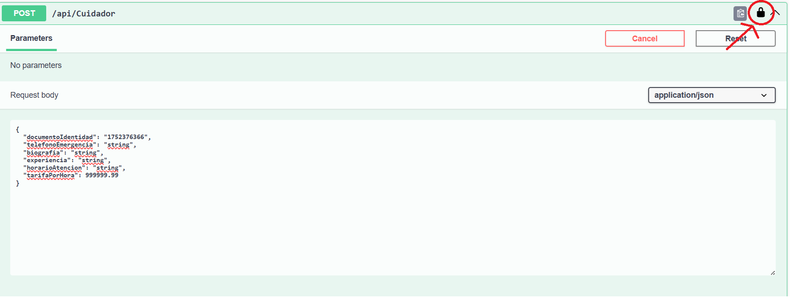
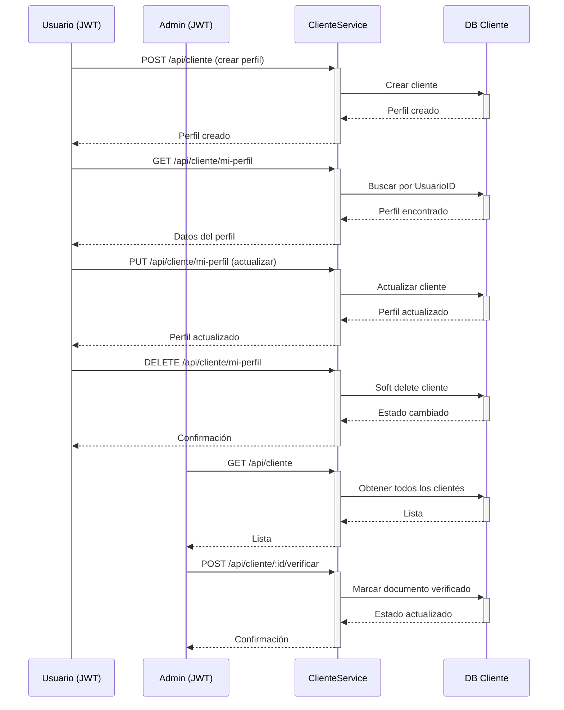

# PetCare Cliente Service 👤

Servicio de microservicios para la gestión de perfiles de clientes de mascotas

## 📋 Descripción

El Cliente Service es parte de la arquitectura de microservicios de PetCare Solution. Se encarga de gestionar los perfiles de los clientes que solicitan servicios de cuidado de mascotas.

## 🏗️ Estructura del Proyecto

```
cliente-service/
├── PetCare.Cliente/
│   ├── Controllers/
│   │   └── ClienteController.cs      # Controlador principal
│   ├── Data/
│   │   └── ClienteDbContext.cs       # Contexto de base de datos
│   ├── Models/
│   │   └── Clientes/
│   │       ├── Cliente.cs            # Entidad principal
│   │       └── ClienteRequest.cs     # DTOs de request/response
│   ├── Services/
│   │   ├── Interfaces/
│   │   │   └── IClienteService.cs    # Interfaz del servicio
│   │   └── ClienteService.cs         # Implementación del servicio
│   ├── Config/
│   │   └── AutoMapperProfile.cs      # Configuración de mapeo
│   ├── appsettings.json              # Configuración principal
│   ├── appsettings.Development.json  # Configuración desarrollo
│   ├── appsettings.Docker.json       # Configuración Docker
│   ├── Program.cs                    # Punto de entrada
│   ├── Dockerfile                    # Configuración Docker
│   └── PetCare.Cliente.http          # Archivo de pruebas
└── README-Cliente.md                 # Esta documentación
```

## 🚀 Funcionalidades

- CRUD completo de perfiles de clientes
- Autenticación JWT para todas las operaciones
- Gestión de perfiles personales (mi-perfil)
- Verificación de documentos (solo administradores)
- Soft Delete para eliminación segura
- Validaciones de datos y reglas de negocio
- AutoMapper para mapeo entre entidades y DTOs
- Migraciones automáticas de Entity Framework
- Swagger/OpenAPI para documentación

## 🔌 Endpoints Disponibles

### 🔓 Públicos
- `GET /api/cliente/test` - Endpoint de prueba (si lo agregas)

### 🔐 Autenticados
- `GET /api/cliente/mi-perfil` - Obtener mi perfil de cliente
- `POST /api/cliente` - Crear perfil de cliente
- `PUT /api/cliente/mi-perfil` - Actualizar mi perfil
- `DELETE /api/cliente/mi-perfil` - Eliminar mi perfil (soft delete)

### 👑 Administradores
- `GET /api/cliente` - Obtener todos los clientes
- `GET /api/cliente/{id}` - Obtener cliente específico
- `POST /api/cliente/{id}/verificar` - Verificar documento

## 🔐 Flujo de Autenticación Completo

### 1. Obtener Token JWT del Auth Service
```bash
curl -X POST http://localhost:5044/api/auth/login \
  -H "Content-Type: application/json" \
  -d '{
    "email": "cliente@ejemplo.com",
    "password": "Password123!"
  }'
```

### 2. Usar Token en Cliente Service
```bash
curl -X POST http://localhost:5256/api/cliente \
  -H "Content-Type: application/json" \
  -H "Authorization: Bearer {token}" \
  -d '{
    "documentoIdentidad": "12345678",
    "telefonoEmergencia": "3001234567"
  }'
```

## 🚀 Inicio Rápido

### 🐳 Con Docker (Recomendado)

#### Prerrequisitos:
- Docker Desktop instalado y corriendo
- PetCare Auth Service corriendo (para autenticación)

#### Pasos:
```bash
cd PetCareSolution
# Iniciar todos los servicios
# docker-compose up -d
# Acceder a Swagger
# Auth: http://localhost:5001/swagger
# Cliente: http://localhost:5009/swagger
```

### 🖥️ Desarrollo Local

#### Prerrequisitos:
- .NET 8.0 SDK
- SQL Server local en puerto 1433
- Usuario SA con contraseña (pon la contraseña de tu SQL Server local aquí)

#### Pasos:
```bash
cd cliente-service/PetCare.Cliente
dotnet run
```
> ℹ️ Al ejecutar `dotnet run` por primera vez, .NET restaurará automáticamente los paquetes NuGet necesarios para ese proyecto. Si prefieres, puedes ejecutar `dotnet restore` manualmente antes de `dotnet run`.

## 📚 Uso de los Endpoints

### Crear Perfil de Cliente
```bash
curl -X POST http://localhost:5045/api/cliente \
  -H "Content-Type: application/json" \
  -H "Authorization: Bearer {token}" \
  -d '{
    "documentoIdentidad": "12345678",
    "telefonoEmergencia": "3001234567"
  }'
```

### Obtener Mi Perfil
```bash
curl -X GET http://localhost:5045/api/cliente/mi-perfil \
  -H "Authorization: Bearer {token}"
```

### Actualizar Mi Perfil
```bash
curl -X PUT http://localhost:5045/api/cliente/mi-perfil \
  -H "Content-Type: application/json" \
  -H "Authorization: Bearer {token}" \
  -d '{
    "documentoIdentidad": "12345678",
    "telefonoEmergencia": "3001234567"
  }'
```

### Eliminar Mi Perfil
```bash
curl -X DELETE http://localhost:5045/api/cliente/mi-perfil \
  -H "Authorization: Bearer {token}"
```

### Obtener Todos los Clientes (Admin)
```bash
curl -X GET http://localhost:5045/api/cliente \
  -H "Authorization: Bearer {admin_token}"
```

### Verificar Documento (Admin)
```bash
curl -X POST http://localhost:5045/api/cliente/1/verificar \
  -H "Authorization: Bearer {admin_token}"
```

## 🗄️ Configuración de Base de Datos

### Docker
- **SQL Server:** `localhost:14410`
- **Usuario:** `sa`
- **Contraseña:** `YourStrong@Passw0rd`
- **Base de datos:** `PetCareCliente` (se crea automáticamente)
- **Contenedor:** `db-cliente`

### Desarrollo Local
- **SQL Server:** `localhost:1433`
- **Usuario:** `sa`
- **Contraseña:** `admin1234`
- **Base de datos:** `PetCareCliente` (se crea automáticamente)

## 🔒 Seguridad

- Autenticación JWT Bearer Token requerido para todos los endpoints
- Autorización por roles para operaciones administrativas
- Validación de datos con Data Annotations
- Soft Delete: los registros no se eliminan físicamente
- Documentos únicos: validación de duplicados

## 🔐 Autenticación en Swagger UI

1. Abrir Swagger UI: http://localhost:5045/swagger (local) o http://localhost:5009/swagger (Docker)
2. Clic en el botón "Authorize" (candado)
3. Pegar el token JWT: `Bearer {tu_token_jwt}`
4. Probar los endpoints protegidos

### 📸 Imagen de Referencia

> **INSERTAR IMAGEN AQUÍ**: Captura de pantalla mostrando el botón de autorización (candado) en Swagger UI y el modal de autorización con el campo para ingresar el token JWT.
Pega el Token ahí.

## Diagrama de Flujo 🔄



## 📝 Roadmap

- [x] CRUD de perfiles de clientes
- [x] Autenticación JWT
- [x] Verificación de documentos (Admin)
- [x] Soft delete
- [x] Migraciones automáticas
- [x] Swagger/OpenAPI
- [x] Docker ready
- [ ] Integración con Request Service
- [ ] Integración con Rating Service
- [ ] Notificaciones
- [ ] Tests unitarios
- [ ] CI/CD pipeline

## 🤝 Contribución

1. Fork el proyecto
2. Crear una rama para tu feature (`git checkout -b feature/AmazingFeature`)
3. Commit tus cambios (`git commit -m 'Add some AmazingFeature'`)
4. Push a la rama (`git push origin feature/AmazingFeature`)
5. Abrir un Pull Request

## 📄 Licencia

Este proyecto está bajo la Licencia MIT - ver el archivo [LICENSE](../../LICENSE) para detalles.

---

**¡Gracias por usar PetCare Cliente Service! 👤** 