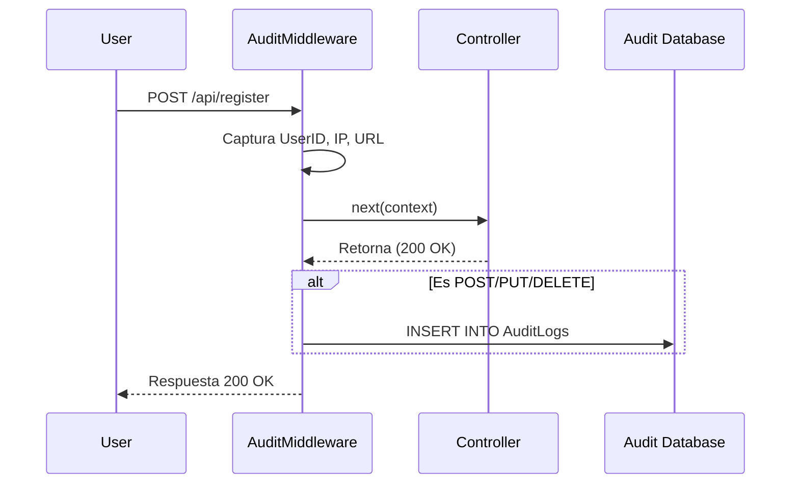

# 📦 PetCare Shared Kernel

**PetCare.Shared** es una biblioteca de clases compartida diseñada para encapsular lógica transversal, modelos comunes y utilidades que son utilizadas por múltiples microservicios dentro del ecosistema PetCare.

Su objetivo es reducir la duplicación de código y estandarizar comportamientos como la auditoría, manejo de excepciones y validaciones comunes.

---

## 🛠️ Componentes

### 1. 📝 Sistema de Auditoría (Audit)

Este componente permite registrar acciones importantes y cambios en el sistema, facilitando el seguimiento y la seguridad.

#### Archivos Principales:
*   `AuditLog.cs`: Modelo de datos (Tabla `AuditLogs`).
*   `IAuditService.cs`: Interfaz para abstraer el almacenamiento de logs.
*   `AuditService.cs`: Implementación que guarda en base de datos usando `AuditDbContext`.
*   `AuditDbContext.cs`: Contexto de EF Core dedicado a la auditoría.
*   `AuditMiddleware.cs`: Middleware automático.

#### 🧠 ¿Cómo funciona el AuditMiddleware?

El `AuditMiddleware` es una pieza de código que se inserta en el "tubo" (pipeline) por donde pasan las peticiones HTTP. Funciona como un interceptor:

1.  **Intercepta la petición**: Cuando llega una solicitud (ej. `POST /api/Auth/register`), el middleware la recibe antes de que llegue al Controlado.
2.  **Captura datos iniciales**: Lee quién es el usuario (si ya pasó por autenticación) y qué ruta está intentando acceder.
3.  **Ejecuta la acción (`await _next(context)`)**: Deja que la petición continúe su camino normal hacia el controlador para que haga su trabajo (ej. registrar al usuario en la BD).
4.  **Intercepta la respuesta**: Cuando el controlador termina, el control regresa al middleware.
5.  **Evalúa y Guarda**:
    *   Verifica si el método HTTP es modificador (POST, PUT, DELETE, PATCH). **Ignora los GET** para no llenar la base de datos de lecturas.
    *   Crea un objeto `AuditLog` con la información capturada (Usuario, IP, Endpoint, Status Code resultante).
    *   Llama al `AuditService` para guardar este registro en la tabla `AuditLogs`.



---

## 🚀 Guía de Integración

Sigue estos pasos para usar el Kernel Compartido en tu microservicio (ej. `request-service`, `auth-service`).

### 1. Agregar Referencia al Proyecto

Desde la carpeta del microservicio o la raíz, ejecuta:

```powershell
dotnet add <RUTA_AL_CSPROJ_DE_TU_SERVICIO> reference shared-kernel/PetCare.Shared/PetCare.Shared.csproj
```

### 2. Registrar Servicios (Dependency Injection)

En tu archivo `Program.cs`, registra la base de datos y los servicios:

```csharp
using PetCare.Shared;
using PetCare.Shared.Data;

var builder = WebApplication.CreateBuilder(args);

// 1. Configurar Entidad Framework para Auditoría
builder.Services.AddDbContext<AuditDbContext>(options =>
{
    // Usa la misma cadena de conexión que tu servicio principal o una dedicada
    options.UseSqlServer(builder.Configuration.GetConnectionString("Default"));
});

// 2. Registrar el servicio
builder.Services.AddScoped<IAuditService, AuditService>();

var app = builder.Build();

// 3. Aplicar Migraciones al inicio (Opcional pero recomendado)
using (var scope = app.Services.CreateScope())
{
    var auditContext = scope.ServiceProvider.GetRequiredService<AuditDbContext>();
    auditContext.Database.Migrate();
}
```

### 3. Usar el Middleware de Auditoría

Para activar la auditoría automática, agrega el middleware **después** de `UseAuthorization`:

```csharp
app.UseAuthentication();
app.UseAuthorization();

// ✅ Registrar Middleware de Auditoría
app.UseMiddleware<AuditMiddleware>();

app.MapControllers();
```

---

## 📋 Modelo de Datos (AuditLog)

| Propiedad | Descripción |
| :--- | :--- |
| `Id` | UUID único del registro. |
| `UserId` | ID del usuario (si está logueado). |
| `Action` | Método HTTP (POST, PUT, DELETE). |
| `EntityName` | URL o nombre del recurso afectado. |
| `Timestamp` | Fecha y hora UTC. |
| `NewValues` | Resultado de la operación (ej. Status: 200). |
| `IpAddress` | Dirección IP del cliente. |
